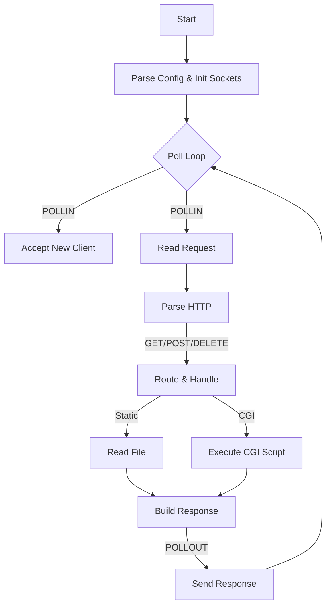

# Webserv – Status & Roadmap

## 📊 Current Status
**Progress:** Mandatory Part Functional. Polishing & Stability Checks Remaining.

| Feature | Status | Notes |
| :--- | :---: | :--- |
| **Config Parser** | ✅ Done | Full parsing including locations, limits & CGI extensions |
| **Event Loop** | ✅ Done | `poll()` based, single-threaded, non-blocking |
| **HTTP Parser** | ✅ Done | Handles Headers, Body, and **Chunked Encoding** |
| **Static Methods** | ✅ Done | GET (files & autoindex), POST (uploads), DELETE |
| **Routing** | ✅ Done | Redirections (301), Error Pages, and Directory Listings work |
| **CGI Execution** | ⚠️ Partial | Basic execution works, but lacks **Timeout** protection |

---

## 🛠 To-Do List (Remaining Tasks)

### 1. High Priority (Mandatory Compliance)
- [ ] **Implement CGI Timeout (Gateway Timeout):**
    - *Goal:* Prevent infinite loops in scripts from hanging the client connection.
    - *Task:* Track CGI start times in `Webserver.cpp` loop. If `(now - start) > TIMEOUT`, kill the child process and return `504`.
- [ ] **Verify Keep-Alive / State Reset:**
    - *Goal:* Ensure `HttpRequest::reset()` and `Client` state clear perfectly between requests.
    - *Task:* Test sending multiple requests in a single `nc` or Telnet session.

### 2. Medium Priority (Robustness)
- [ ] **Large File Upload Handling:**
    - *Goal:* Prevent RAM exhaustion on large uploads.
    - *Task:* Verify `client_max_body_size` check happens *before* or *during* buffering, not just after.
- [ ] **Check Upload Permissions:**
    - *Goal:* Prevent crashes if the upload directory doesn't exist or is read-only.
    - *Task:* Ensure `std::ofstream` failure returns `500 Internal Server Error` (already implemented, just verify).

---

## 📐 Architecture Design

This data flow represents how the server handles non-blocking I/O and request processing.



---

## 📂 Project Structure

```text
/includes
  ├── Config.hpp        # Structs for Server/Location config
  ├── HttpRequest.hpp   # Request parsing state machine
  ├── HttpResponse.hpp  # Logic for building responses (GET/POST/DELETE)
  └── Webserver.hpp     # Main poll() loop and socket management

/srcs
  ├── Config.cpp        # Parser implementation
  ├── HttpRequest.cpp   # Chunked decoding & header parsing
  ├── HttpResponse.cpp  # Static file serving & Uploads
  └── Webserver.cpp     # Socket init & Event loop
