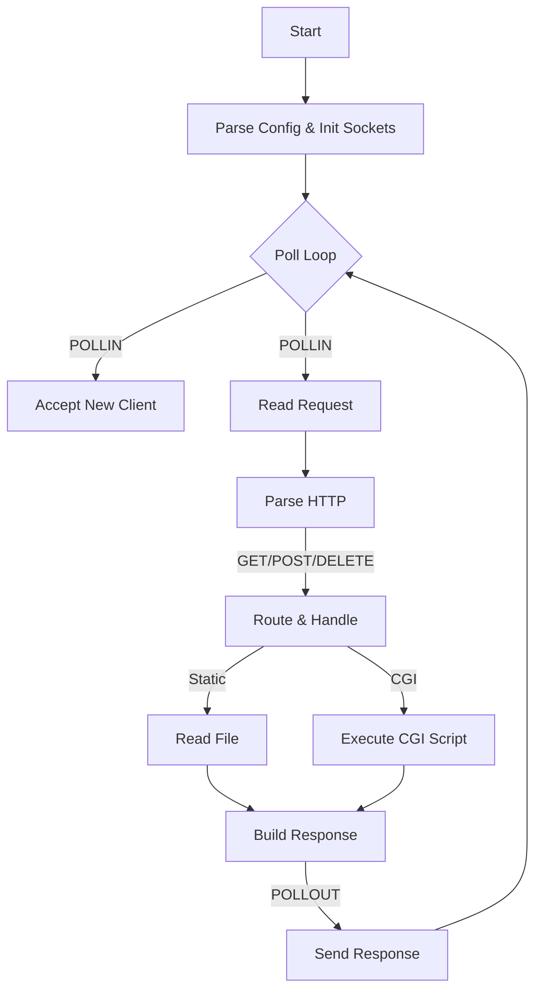

# Webserv – Status & Roadmap

1. Updated Project Status & To-Do List

Your README.md is significantly outdated. You have already implemented almost all Mandatory features. Here is the corrected status:
📊 Current Status (Revised)
Feature	Status	Notes
Config Parser	✅ Done	Full parsing including locations & CGI extensions.
Event Loop	✅ Done	poll() based, single-threaded, non-blocking.
HTTP Parser	✅ Done	Handles Headers, Body, and Chunked Encoding.
Static Methods	✅ Done	GET, POST (uploads), DELETE implemented.
Routing	✅ Done	Autoindex, Redirects (301), & Error Pages are implemented.
CGI Execution	⚠️ Partial	Basic execution works (fork/exec/pipe), but lacks Timeout protection.
🛠 Updated To-Do List (Remaining Tasks)

High Priority (Mandatory Compliance)

    Implement CGI Timeout:

        Why: The server currently waits indefinitely for a script to finish. If a script loops forever, that client connection hangs forever.

        Task: In Webserver::run(), check the timestamp of active CGI processes. If (now - start_time) > TIMEOUT, kill() the child PID and return a 504 Gateway Timeout.

    Verify Keep-Alive / State Reset:

        Why: Your responses send Connection: keep-alive, but you must ensure HttpRequest::reset() and Client state are perfectly cleared after a response so the FD can be reused for a second request.

        Task: Test sending 2 requests in a single nc connection.

Medium Priority (Robustness)

    Large File Upload Handling:

        Why: Currently, you buffer the entire un-chunked body in std::string _body.

        Task: Verify this respects client_max_body_size. If a user sends 1GB and your limit is 10MB, you must cut them off early (413 Entity Too Large) before running out of RAM.

---

## 📐 Architecture Design

This data flow represents how the server handles non-blocking I/O and request processing.


```mermaid
graph TD
    start[Start] --> init[Parse Config & Init Sockets]
    init --> loop{Poll Loop}
    loop -->|POLLIN| accept[Accept New Client]
    loop -->|POLLIN| read[Read Request]
    read --> parse[Parse HTTP]
    parse -->|GET/POST/DELETE| route[Route & Handle]
    route -->|Static| file[Read File]
    route -->|CGI| cgi[Execute CGI Script]
    file --> build[Build Response]
    cgi --> build
    build -->|POLLOUT| send[Send Response]
    send --> loop
```

---

## 📂 Project Structure

```text
/includes
  ├── Config.hpp        # Structs for Server/Location config
  ├── HttpRequest.hpp   # Request parsing state machine
  ├── HttpResponse.hpp  # Logic for building responses (GET/POST/DELETE)
  └── Webserver.hpp     # Main poll() loop and socket management

/srcs
  ├── Config.cpp        # Parser implementation
  ├── HttpRequest.cpp   # Chunked decoding & header parsing
  ├── HttpResponse.cpp  # Static file serving & Uploads
  └── Webserver.cpp     # Socket init & Event loop
