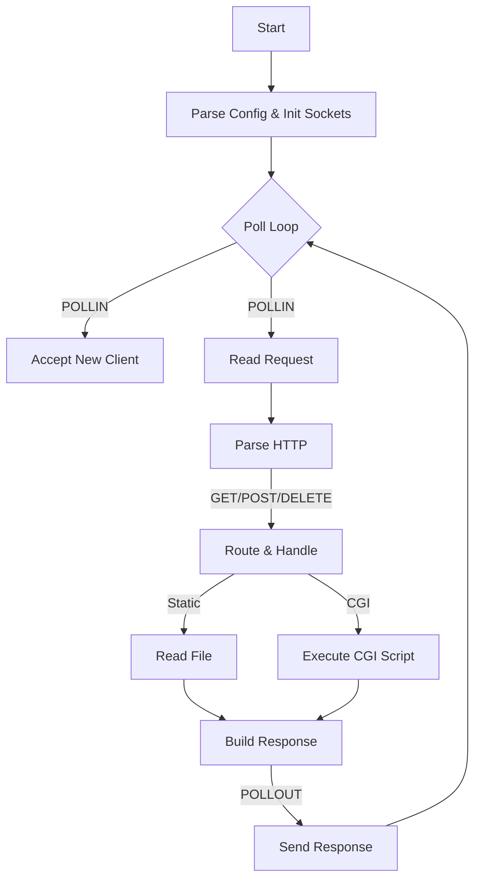

# Webserv – Status & Roadmap

## 📊 Current Status
**Progress:** Phase 1 & 2 Complete (Core & Parsing). Phase 3 (Logic) in progress.

| Feature | Status | Notes |
| :--- | :---: | :--- |
| **Config Parser** | ✅ Done | parsing servers, locations, limits |
| **Event Loop** | ✅ Done | `poll()`, non-blocking I/O, single thread |
| **HTTP Parser** | ✅ Done | State machine, headers, **Chunked encoding** support |
| **Static Methods** | ✅ Done | GET (files), POST (uploads), DELETE |
| **Routing** | ⚠️ Partial | Matches paths, but Autoindex & Redirects logic missing |
| **Error Handling** | ⚠️ Partial | Hardcoded responses (custom error pages parsing exists but unused) |
| **CGI** | ❌ Todo | Logic for fork/execve/pipe needs to be added |

---

## 📐 Architecture Design

This data flow represents how the server handles non-blocking I/O and request processing.


```mermaid
graph TD
    start[Start] --> init[Parse Config & Init Sockets]
    init --> loop{Poll Loop}
    loop -->|POLLIN| accept[Accept New Client]
    loop -->|POLLIN| read[Read Request]
    read --> parse[Parse HTTP]
    parse -->|GET/POST/DELETE| route[Route & Handle]
    route -->|Static| file[Read File]
    route -->|CGI| cgi[Execute CGI Script]
    file --> build[Build Response]
    cgi --> build
    build -->|POLLOUT| send[Send Response]
    send --> loop
```
---

## 🛠 To-Do List (Immediate Priorities)

### 1. Fix Routing Features (Easy Wins)
- [ ] **Implement Redirects:** Update `HttpResponse` to check if a location has a `return` code (e.g., 301). If so, send the redirect header immediately.
- [ ] **Implement Autoindex:** In `handleGetRequest`, if the target is a directory and `autoindex` is on, generate a simple HTML list of files in that folder instead of returning 403.
- [ ] **Connect Custom Error Pages:** Update `buildErrorResponse` to look up the error code in `ServerConfig.error_pages`. If found, serve that file instead of the hardcoded string.

### 2. The CGI Monster (The Big Task)
- [ ] Detect if a requested file matches a CGI extension (e.g., `.php`, `.py`).
- [ ] Set up `fork()` and `execve()`.
- [ ] **Environment Variables:** Map HTTP headers to CGI vars (`REQUEST_METHOD`, `QUERY_STRING`, `CONTENT_LENGTH`, `PATH_INFO`, etc.).
- [ ] **Pipes:**
    - Pipe 1: Server -> CGI (Write request body to CGI's stdin).
    - Pipe 2: CGI -> Server (Read CGI's stdout).
- [ ] **Gateway Timeout:** Handle cases where the script hangs (kill child process).

---

## 📂 Project Structure

```text
/includes
  ├── Config.hpp        # Structs for Server/Location config
  ├── HttpRequest.hpp   # Request parsing state machine
  ├── HttpResponse.hpp  # Logic for building responses (GET/POST/DELETE)
  └── Webserver.hpp     # Main poll() loop and socket management

/srcs
  ├── Config.cpp        # Parser implementation
  ├── HttpRequest.cpp   # Chunked decoding & header parsing
  ├── HttpResponse.cpp  # Static file serving & Uploads
  └── Webserver.cpp     # Socket init & Event loop
